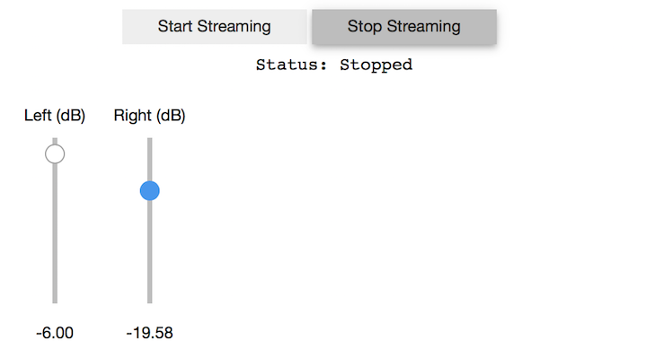
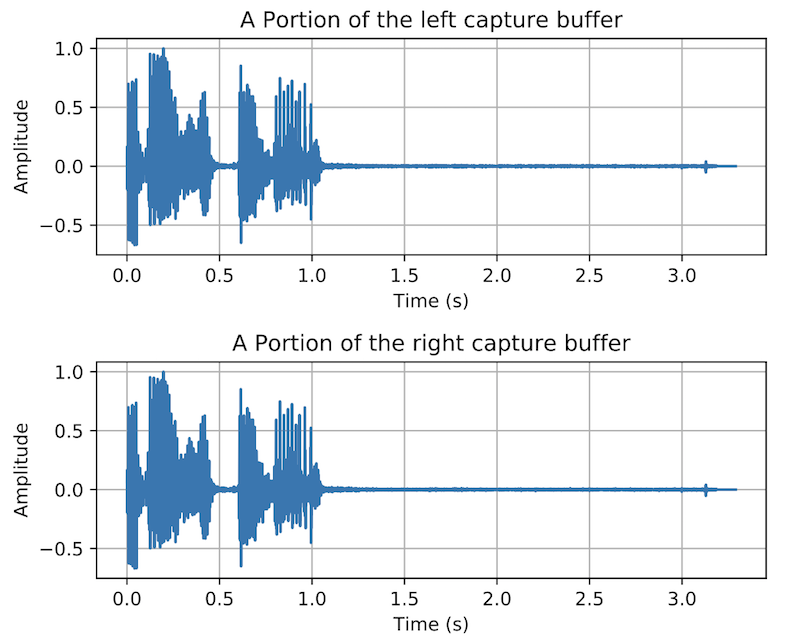

# scikit-dsp-comm

[](https://pypi.python.org/pypi/scikit-dsp-comm)
[](http://scikit-dsp-comm.readthedocs.io/en/latest/?badge=latest)


## Background

 The origin of this package comes from the writing the book Signals and Systems for Dummies, published by Wiley in 2013. The original module for this book is named `ssd.py`. In `scikit-dsp-comm` this module is renamed to `sigsys.py` to better reflect the fact that signal processing and communications theory is founded in signals and systems, a traditional subject in electrical engineering curricula.

## Package High Level Overview

This package is a collection of functions and classes to support signal processing and communications theory teaching and research. The foundation for this package is `scipy.signal`. The code in particular currently runs under Python `2.7x` and `3.6x`.


We are striving for improved documentation, with examples. Minor bugs are being fixed. New features are planned, in particular a `GPS_helper` module and additions to the `synchronization` module. There is also a desire to improve the `fec_conv` to move develop rate 1/3 codes and the use of compiled code to improve performance


The real-time audio DSP capabilities of `pyaudio_helper` allow for two channel algorithm development with real-time user control enabled by the `ipywidgets` when running in the Jupyter notebook.

Finally, there is a strong desire to utilize the real-time DSP capabilities of `pyaudio_helper` to allow real-time streaming of complex baseband (IQ) signals from `rtlsdr_helper` through demodulation algorithms and out through the Pyaudio interface.


**There are presently ten modules that make up scikit-dsp-comm:**

1. `sigsys.py` for basic signals and systems functions both continuous-time and discrete-time, including graphical display tools such as pole-zero plots, up-sampling and down-sampling.

2. `digitalcomm.py` for digital modulation theory components, including asynchronous resampling and variable time delay functions, both useful in advanced modem testing.

3. `synchronization.py` which contains phase-locked loop simulation functions and functions for carrier and phase synchronization of digital communications waveforms.

4. `fec_conv.py` for the generation rate one-half convolutional codes and soft decision Viterbi algorithm decoding, including trellis and trellis-traceback display functions.

5. `fir_design_helper.py` which for easy design of lowpass, highpass, bandpass, and bandstop filters using the Kaiser window and equal-ripple designs, also includes a list plotting function for easily comparing magnitude, phase, and group delay frequency responses.

6. `iir_design_helper.py` which for easy design of lowpass, highpass, bandpass, and bandstop filters using scipy.signal Butterworth, Chebyshev I and II, and elliptical designs, including the use of the cascade of second-order sections (SOS) topology from scipy.signal, also includes a list plotting function for easily comparing of magnitude, phase, and group delay frequency responses.

7. `multirate.py` that encapsulate digital filters into objects for filtering, interpolation by an integer factor, and decimation by an integer factor.

8. `coeff2header.py` write `C/C++` header files for FIR and IIR filters implemented in `C/C++`, using the cascade of second-order section representation for the IIR case. This last module find use in real-time signal processing on embedded systems, but can be used for simulation models in `C/C++`.

Presently the collection of modules contains about 125 functions and classes. The authors/maintainers are working to get more detailed documentation in place.

### Extras

This package contains the helper modules `rtlsdr_helper`, and `pyaudio_helper` which require the packages [pyrtlsdr](https://pypi.python.org/pypi/pyrtlsdr) and [PyAudio](https://pypi.python.org/pypi/PyAudio). To use the full functionality of these helpers, install the package from the scikit-dsp-comm folder as follows:\
```
pip install -e .[helpers]
```
Installation is described in greater detail below.

1. `pyaudio_helper.py` wraps a class around the code required in `PyAudio` (wraps the C++ library `PortAudio`) to set up a non-blocking audio input/output stream. The user only has to write the callback function to implement real-time DSP processing using any of the input/output devices available on the platform. This resulting object also contains a capture buffer for use in post processing and a timing markers for assessing the processing time utilized by the callback function. When developing apps in the Jupyter Notebook there is support for the `IPywidgets` along with threading. 

2. `rtlsdr_helper.py` interfaces with `pyrtldsr` to provide a simple captures means for complex baseband software defined radio (SDR) samples from the low-cost (~$20) RTL-SDR USB hardware dongle. The remaining functions in this module support the implementation of demodulators for FM modulation and examples of complete receivers for FM mono, FM stereo, and tools for FSK demodulation, including bit synchronization.


## Documentation
Documentation is now housed on `readthedocs` which you can get to by clicking the docs badge near the top of this `README`. Example notebooks can be viewed on [GitHub pages](https://mwickert.github.io/scikit-dsp-comm/). In time more notebook postings will be extracted from [Dr. Wickert's Info Center](http://www.eas.uccs.edu/~mwickert/).

## Getting Set-up on Your System

The best way to use this package is to clone this repository and then install it. 

```bash
git clone https://github.com/mwickert/scikit-dsp-comm.git
```

There are package dependencies for some modules that you may want to avoid. Specifically these are whenever hardware interfacing is involved. Specific hardware and software configuration details are discussed in [wiki pages](https://github.com/mwickert/SP-Comm-Tutorial-using-scikit-dsp-comm/wiki). For Windows users `pip` install takes care of almost everything. I assume below you have Python on your path, so for example with [Anaconda](https://www.anaconda.com/download/#macos), I suggest letting the installer set these paths up for you.

### Editable Install with Dependencies

With the terminal in the root directory of the cloned repo perform an editable `pip` install using

```bash
pip install -e .[helpers]
```

### Editable Install without Dependencies

To install without the PyAudio and RTL-SDR dependency, and hence not be able to use those modules,

```bash
pip install -e .
```

On Windows the binaries needed for `pyaudio` should install, but on other platforms you will have to do some more work (Conda Forge install pending at the close of Scipy 2017 sprints). All the capability of the package is available less `pyaudio` and the RTL-SDR radio with doing any special installations. See the [wiki pages](https://github.com/mwickert/SP-Comm-Tutorial-using-scikit-dsp-comm/wiki) for more information.

### Why an Editable Install?

The advantage of the editable `pip` install is that it is very easy to keep `scikit-dsp-comm ` up to date. If you know that updates have been pushed to the master branch, you simply go to your local repo folder and

```bash
git pull origin master
```

This will update you local repo and automatically update the Python install without the need to run `pip` again. **Note**: If you have any Python kernels running, such as a Jupyter Notebook, you will need to restart the kernel to insure any module changes get reloaded.

------

## Feature: Real-Time DSP with `pyaudio_helper`
A real-time DSP experience is possible right in the Jupyter notebook. Fall 1017 updates to `pyaudio_helper` make it possible to do two channel audio (stereo) and include interactivity using the `ipywidgets`. The `callback` function for a simple *loop-through* is given below. Note: Not all of the code is shown here, but is available [here](https://mwickert.github.io/scikit-dsp-comm/)

#### Finding the Indices of the Available Audio Devices
```python
import sk_dsp_comm.pyaudio_helper as pah

# Check system audio devices available
pah.available_devices()
```
```bash
Index 0 device name = Built-in Microphone, inputs = 2, outputs = 0
Index 1 device name = Built-in Output, inputs = 0, outputs = 2
Index 2 device name = iMic USB audio system, inputs = 2, outputs = 2
```
You can think of the device index as a jack number on an audio patch panel.

#### Write a Simple Callback
Here each frame is processed using `ndarrays` and gain scaling is applied at the frame level. In general processing must be done sample-by-sample. Python `globals` can be used to maintain the state of a given DSP algorithm, e.g., an FIR or IIR filter.

```python
# Scale right and left channels independently
def callback(in_data, frame_count, time_info, status):  
    DSP_IO.DSP_callback_tic()
    # convert byte data to ndarray
    in_data_nda = np.fromstring(in_data, dtype=np.int16)
    # separate left and right data
    x_left,x_right = DSP_IO.get_LR(in_data_nda.astype(float32))
    #***********************************************
    # DSP operations here
    
    y_left = volume_scale_left.value*x_left
    y_right = volume_scale_right.value*x_right
    
    #***********************************************
    # Pack left and right data together
    y = DSP_IO.pack_LR(y_left,y_right)
    # Typically more DSP code here     
    #***********************************************
    # Save data for later analysis
    # accumulate a new frame of samples
    DSP_IO.DSP_capture_add_samples_stereo(y_left,y_right)
    #***********************************************
    # Convert from float back to int16
    y = y.astype(int16)
    DSP_IO.DSP_callback_toc()
    # Convert ndarray back to bytes
    #return (in_data_nda.tobytes(), pyaudio.paContinue)
    return y.tobytes(), pah.pyaudio.paContinue
```
#### `DSP_IO` Object Creation and Streaming
With the callback in place we are now ready to create a `DSP_IO` object and start streaming.

```python
N_FRAME = 512
# Create streaming object: use Built-in mic (idx = 0) and output (idx = 1)
DSP_IO = pah.DSP_io_stream(callback,in_idx=0,out_idx=1,fs=44100,
                           frame_length = N_FRAME,Tcapture = 10) 

# use thread stream so widget can be used; Tsec = 0 <==> infinite stream
DSP_IO.interactive_stream(Tsec = 20, numChan = 2) # 20 Second stereo stream

# display volume control widgets
widgets.HBox([volume_dB_left,volume_dB_right])
```


#### A Portion of the Capture Buffer from MacBook Mic Input


------
