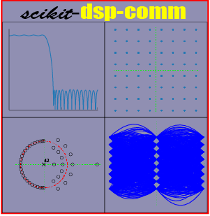

# scikit-dsp-comm

[](https://pypi.python.org/pypi/scikit-dsp-comm)
[](https://anaconda.org/conda-forge/scikit-dsp-comm)
[](http://scikit-dsp-comm.readthedocs.io/en/latest/?badge=latest)

## Background

 The origin of this package comes from the writing the book Signals and Systems for Dummies, published by Wiley in 2013. The original module for this book is named `ssd.py`. In `scikit-dsp-comm` this module is renamed to `sigsys.py` to better reflect the fact that signal processing and communications theory is founded in signals and systems, a traditional subject in electrical engineering curricula.

## Package High Level Overview

This package is a collection of functions and classes to support signal processing and communications theory teaching and research. The foundation for this package is `scipy.signal`. The code in particular currently requires Python `>=3.5x`.


**There are presently ten modules that make up scikit-dsp-comm:**

1. `sigsys.py` for basic signals and systems functions both continuous-time and discrete-time, including graphical display tools such as pole-zero plots, up-sampling and down-sampling.

2. `digitalcomm.py` for digital modulation theory components, including asynchronous resampling and variable time delay functions, both useful in advanced modem testing.

3. `synchronization.py` which contains phase-locked loop simulation functions and functions for carrier and phase synchronization of digital communications waveforms.

4. `fec_conv.py` for the generation rate one-half and one-third convolutional codes and soft decision Viterbi algorithm decoding, including soft and hard decisions, trellis and trellis-traceback display functions, and puncturing.

5. `fir_design_helper.py` which for easy design of lowpass, highpass, bandpass, and bandstop filters using the Kaiser window and equal-ripple designs, also includes a list plotting function for easily comparing magnitude, phase, and group delay frequency responses.

6. `iir_design_helper.py` which for easy design of lowpass, highpass, bandpass, and bandstop filters using scipy.signal Butterworth, Chebyshev I and II, and elliptical designs, including the use of the cascade of second-order sections (SOS) topology from scipy.signal, also includes a list plotting function for easily comparing of magnitude, phase, and group delay frequency responses.

7. `multirate.py` that encapsulate digital filters into objects for filtering, interpolation by an integer factor, and decimation by an integer factor.

8. `coeff2header.py` write `C/C++` header files for FIR and IIR filters implemented in `C/C++`, using the cascade of second-order section representation for the IIR case. This last module find use in real-time signal processing on embedded systems, but can be used for simulation models in `C/C++`.

Presently the collection of modules contains about 125 functions and classes. The authors/maintainers are working to get more detailed documentation in place.


## Documentation
Documentation is now housed on `readthedocs` which you can get to by clicking the docs badge near the top of this `README`. Example notebooks can be viewed on [GitHub pages](https://mwickert.github.io/scikit-dsp-comm/). In time more notebook postings will be extracted from [Dr. Wickert's Info Center](http://www.eas.uccs.edu/~mwickert/).

## Getting Set-up on Your System

The best way to use this package is to clone this repository and then install it. 

```bash
git clone https://github.com/mwickert/scikit-dsp-comm.git
```

There are package dependencies for some modules that you may want to avoid. Specifically these are whenever hardware interfacing is involved. Specific hardware and software configuration details are discussed in [wiki pages](https://github.com/mwickert/SP-Comm-Tutorial-using-scikit-dsp-comm/wiki).

For Windows users `pip` install takes care of almost everything. I assume below you have Python on your path, so for example with [Anaconda](https://www.anaconda.com/download/#macos), I suggest letting the installer set these paths up for you.

### Editable Install with Dependencies

With the terminal in the root directory of the cloned repo perform an editable `pip` install using

```bash
pip install -e .
```

### Why an Editable Install?

The advantage of the editable `pip` install is that it is very easy to keep `scikit-dsp-comm ` up to date. If you know that updates have been pushed to the master branch, you simply go to your local repo folder and

```bash
git pull origin master
```

This will update you local repo and automatically update the Python install without the need to run `pip` again. **Note**: If you have any Python kernels running, such as a Jupyter Notebook, you will need to restart the kernel to insure any module changes get reloaded.
